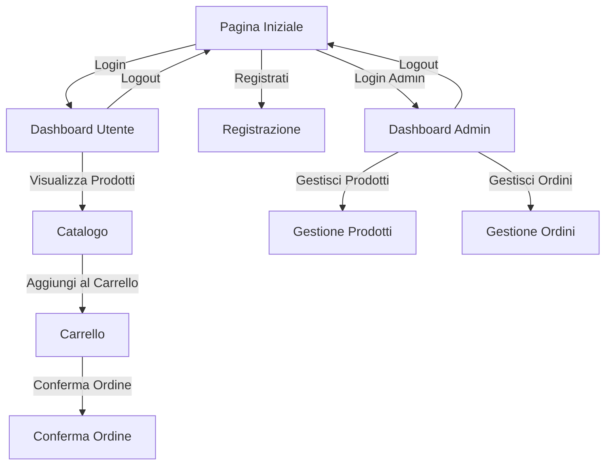
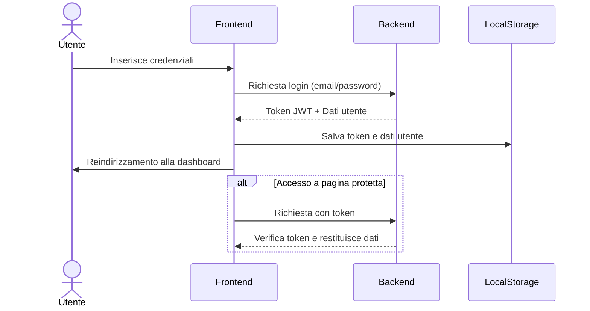
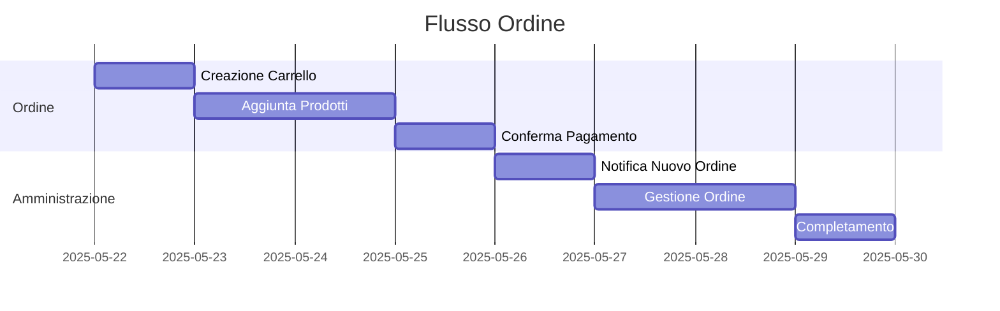

# Flusso dell'Applicazione - Gestionale Oratorio

## Mappa del Sito

## Flusso Utente Non Autenticato

1. **Pagina Iniziale** (`/`)
   - Visualizza il messaggio di benvenuto
   - Mostra il form di login
   - Link alla pagina di registrazione
   - Se l'utente è già loggato, reindirizza alla dashboard appropriata

2. **Pagina di Registrazione** (`/registrazione.html`)
   - Form per la creazione di un nuovo account utente
   - Validazione lato client dei campi obbligatori
   - Link per tornare alla pagina di login

## Flusso Utente Autenticato

1. **Dashboard Utente** (`/dashboard.html`)
   - Benvenuto personalizzato
   - Accesso rapido alle funzionalità principali
   - Menu di navigazione

2. **Catalogo Prodotti** (`/catalogo.html`)
   - Griglia di prodotti disponibili
   - Filtri per categoria
   - Barra di ricerca
   - Pulsante "Aggiungi al carrello" per ogni prodotto

3. **Carrello** (`/carrello.html`)
   - Riepilogo prodotti selezionati
   - Modifica quantità/rimozione prodotti
   - Calcolo automatico del totale
   - Pulsante "Procedi all'ordine"

4. **Conferma Ordine** (`/conferma-ordine.html`)
   - Riepilogo ordine
   - Form per eventuali note
   - Pulsante "Conferma ordine"
   - Messaggio di conferma con numero ordine

## Flusso Amministratore

1. **Dashboard Admin** (`/admin/dashboard.html`)
   - Pannello di controllo con statistiche
   - Accesso rapido alle funzionalità amministrative
   - Notifiche sugli ordini in sospeso

2. **Gestione Prodotti** (`/admin/prodotti.html`)
   - Lista prodotti con opzioni modifica/elimina
   - Pulsante "Aggiungi Prodotto"
   - Form di modifica/aggiunta prodotto
   - Gestione categorie

3. **Gestione Ordini** (`/admin/ordini.html`)
   - Lista ordini con filtri per stato
   - Dettaglio ordine con prodotti e quantità
   - Opzioni per cambiare stato ordine
   - Filtri per data/utente/stato

## Flusso di Autenticazione

## Gestione dello Stato dell'Applicazione

1. **Local Storage**
   - Token di autenticazione
   - Dati utente di base
   - Carrello non confermato

2. **Session Management**
   - Timeout sessione dopo inattività
   - Rinnovo automatico token
   - Logout su chiusura finestra (opzionale)

## Gestione Errori

1. **Errori di Autenticazione**
   - Credenziali non valide
   - Sessione scaduta
   - Permessi insufficienti

2. **Errori di Connessione**
   - Server non raggiungibile
   - Timeout richieste
   
3. **Errori di Validazione**
   - Campi obbligatori mancanti
   - Formato dati non valido
   - Vincoli di integrità

## Flusso di Conferma Ordine

## Considerazioni Aggiuntive

1. **Sicurezza**
   - Validazione lato client e server
   - Protezione contro XSS e CSRF
   - Hashing delle password
   - Rate limiting

2. **Usabilità**
   - Feedback visivi per le azioni
   - Messaggi di errore chiari
   - Conferme per operazioni distruttive
   - Navigazione intuitiva

3. **Performance**
   - Lazy loading delle immagini
   - Paginazione dei risultati
   - Cache delle risorse statiche
   - Ottimizzazione delle query

## Prossimi Passi

1. Implementare le singole pagine HTML
2. Sviluppare il CSS per la responsività
3. Implementare la logica JavaScript
4. Creare le API di backend
5. Testare il flusso completo
6. Ottimizzare le performance
