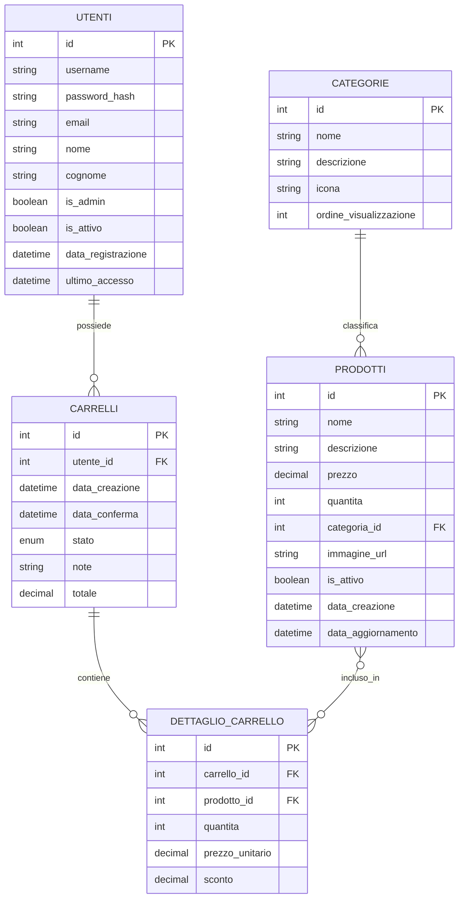

# Schema del Database - Gestionale Oratorio

## Struttura delle Tabelle

## Descrizione Dettagliata

### 1. UTENTI
- **id**: Chiave primaria autoincrementale
- **username**: Nome utente univoco per il login
- **password_hash**: Password crittografata con algoritmo di hashing sicuro
- **email**: Email dell'utente (univoca)
- **nome**: Nome anagrafico
- **cognome**: Cognome anagrafico
- **is_admin**: Flag per identificare gli amministratori
- **is_attivo**: Flag per disabilitare temporaneamente l'account
- **data_registrazione**: Timestamp di creazione account
- **ultimo_accesso**: Data dell'ultimo accesso

### 2. CATEGORIE
- **id**: Chiave primaria autoincrementale
- **nome**: Nome della categoria (es. "Bibite", "Merende")
- **descrizione**: Descrizione della categoria
- **icona**: Nome dell'icona da visualizzare nell'interfaccia
- **ordine_visualizzazione**: Ordine di visualizzazione nel frontend

### 3. PRODOTTI
- **id**: Chiave primaria autoincrementale
- **nome**: Nome del prodotto
- **descrizione**: Descrizione dettagliata
- **prezzo**: Prezzo unitario (in euro)
- **quantita**: Quantità disponibile a magazzino
- **categoria_id**: Riferimento alla categoria di appartenenza
- **immagine_url**: Percorso all'immagine del prodotto
- **is_attivo**: Flag per attivare/disattivare la visibilità
- **data_creazione**: Timestamp di creazione
- **data_aggiornamento**: Timestamp di ultima modifica

### 4. CARRELLI
- **id**: Chiave primaria autoincrementale
- **utente_id**: Riferimento all'utente proprietario
- **data_creazione**: Timestamp di creazione carrello
- **data_conferma**: Timestamp di conferma ordine (NULL se non confermato)
- **stato**: Stato del carrello (in_sospeso, confermato, annullato, evaso)
- **note**: Note aggiuntive (es. allergie, richieste speciali)
- **totale**: Importo totale del carrello (calcolato)

### 5. DETTAGLIO_CARRELLO
- **id**: Chiave primaria autoincrementale
- **carrello_id**: Riferimento al carrello
- **prodotto_id**: Riferimento al prodotto
- **quantita**: Quantità selezionata
- **prezzo_unitario**: Prezzo unitario al momento dell'acquisto
- **sconto**: Eventuale sconto applicato (in euro)

## Miglioramenti Apportati

1. Aggiunto `ultimo_accesso` in UTENTI per tracciare l'ultimo accesso
2. Aggiunti campi `icona` e `ordine_visualizzazione` in CATEGORIE per una migliore gestione del frontend
3. Aggiunto `data_aggiornamento` in PRODOTTI per tracciare le modifiche
4. Migliorato il campo `stato` in CARRELLI con più stati possibili
5. Aggiunto `totale` in CARRELLI per memorizzare l'importo totale
6. Aggiunto `sconto` in DETTAGLIO_CARRELLO per gestire sconti sui singoli prodotti
7. Aggiunto supporto per note sugli ordini

## Considerazioni Aggiuntive

- Tutte le tabelle hanno un campo ID autoincrementale come chiave primaria
- I timestamp sono gestiti in formato datetime
- I prezzi sono memorizzati come decimali per evitare problemi di arrotondamento
- Le relazioni sono gestite tramite chiavi esterne
- La struttura è progettata per essere scalabile e flessibile

## Prossimi Passi

1. Implementare le query SQL per la creazione del database
2. Creare le stored procedure per le operazioni più comuni
3. Implementare i trigger per il calcolo automatico dei totali
4. Creare le viste per semplificare le query complesse
